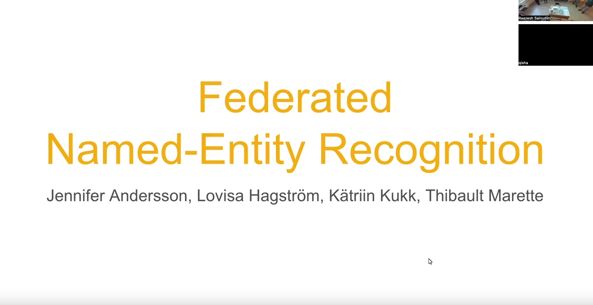

# NERF Project: Federated Learning for Named Entity Recognition

Authors: Jennifer Andersson (Uppsala universitet), Lovisa Hagström (Chalmers tekniska högskola), Kätriin Kukk (Linköpings universitet) and Thibault Marette (Kungliga Tekniska högskolan).

## Table of Contents
1. [Project deliverable](#1-project-deliverable)
    - [Project description](#project-description)
    - [Authors contribution](#authors-contribution)
2. [Structure of the repository](#2-repository-structure)
3. [Setup](#3-setup)
4. [Quickstart example](#4-quickstart-example)
5. [Complete example](#5-complete-example)
6. [Other tutorials](#6-other-tutorials)
    - [Running batch job on Alvis](#61-running-batch-job-on-alvis)
    - [Running tests with Pytest](#62-running-tests-with-pytest)
    - [Scaling up the project](#63-scaling-up-the-project)
7. [Acknowledgements](#7-Acknowledgements)

---

## 1. Project deliverable

A project report summarizing the problem, methods and results is available [here (ipynb)](https://colab.research.google.com/drive/1K93_OoAdp3YAN8H6gxUFohUYcIfEvj7S?usp=sharing). The slides used for the oral presentation are available [here (pdf)](slides/NERF_WASP.pdf) or [here (pptx)](slides/NERF_WASP.pptx). A recording of the project presentation is available [](https://youtu.be/eVNabHd_f8Y?si=LD_BPidxPKw9S76f)

### Project description


In this project we employed federated learning to train a language model for named entity recognition (NER) across several Scandinavian languages (Swedish, Danish and Norwegian). In this setup, several clients, each with their own dataset, want to collaborate on building a shared NER model. However, due to privacy regulations (for instance), these clients are unable to exhange their datasets. To address this problem, we leverage federated learning, where each client trains their own NER model locally with their own data, and only communicates new weights with a global model, shared between all the clients. The global model is then updated by aggregating the received weights, using a federated aggregation strategy.

Our implemenation was deployed on an Alvis node, with each client running on a separate GPU. We evaluated the performance of our federated approach using precision, recall, and F1-score metrics, and compared it against a baseline model trained without the federated framework.


### Authors' contributions

- **Jennifer** helped develop the implementation for federated learning of a RoBERTa model for NER. She also set up the evaluation scheme and was responsible for setting up an outline for the presentation slides and report. She also took on responsibility for the report writing and constructing part of the presentation slides.

- **Lovisa** helped develop the code for training a RoBERTa model on NER datasets in a federated manner. She also contributed to setting up the environment and scripts for running the code on the HPC cluster, Alvis. 

- **Kätriin** helped set up the initial code and the environment for doing federated learning and was responsible for setting up the code for and running the baseline experiments (in run_baseline.py). In addition, she prepared code so that it is possible to run our code in a non-simulated setup (still on the same node).

- **Thibault** helped finding unified high quality datasets for NER tasks, in different languages. He also took responsability of writing a clear and detailed README file for the Github repository, for reproducibility of the results.

All authors participated in the discussion and analysis of the results, and contributed equally to the presentation slides and the written report of the project.

---

## 2. Repository Structure

The repository is organised as follows:

```
nerf_wasp/
├── slides/ # slides used for the presentations
├── scripts/                                   # See section 6.1 below
│   ├── alvis_roberta_base_2_dset.sh           # Runs the federated algorithm for 2 clients (Setting 1 (S1))
│   ├── alvis_roberta_base_3_dset.sh           # Runs the federated algorithm for 3 clients (Setting 2 (S2))
│   ├── alvis_roberta_base_all_dset.sh         # Runs the federated algorithm for 4 clients (Setting 3 (S3))
│   ├── alvis_roberta_base_baseline_dset.sh    # Runs the baseline algorithm
├── src/
│   ├── __init__.py
│   ├── client_app.py                          # Defines the client app 
│   ├── client_app_federated_nonsimulated.py   # Defines the client app in a nonsimulated federated setting
│   ├── federated_learning_nonsimulated.py     # Defines the nonsimulated federated algorithm (section 5)
│   ├── run_baseline.py                        # Defines the baseline algorithm (section 5)
│   ├── server_app.py                          # Defines the server app
│   ├── server_app_federated_nonsimulated.py   # Defines the server app in a nonsimulated federated setting
│   └── task.py                                # Defines the model, data loading and logging
├── test/
│   ├── test_flwr.py                           # Execute a test run with flower
├── LICENSE                                    # License
├── pyproject.toml                             # Project metadata like dependencies and configs
└── README.md

```


---

Three main scripts are used to train the model using the federated learning framework Flower: client_app.py, server_app.py and task.py (located in the src-folder). We provide two sets of scripts (simulated and non-simulated), but the results presented in the report are obtained using the simulated setting, i.e. the scripts named client_app.py, server_app.py and task.py. For details regarding the purpose of each of these scripts in the federated setup, see Section 4 in the report. You find the report [here (ipynb)](https://colab.research.google.com/drive/1K93_OoAdp3YAN8H6gxUFohUYcIfEvj7S?usp=sharing).


## 3. Setup

Before running the [quickstart Example](#4-quickstart-example) or the [complete example](#5-complete-example), ensure that the required packages are installed and you are logged into your Wandb account.


1. Load required modules:

```bash
module purge
module load Python/3.10.8-GCCcore-12.2.0
```

2. **One time only** Create the virtual environment (example for Alvis, X-YY is your project number):
```bash
python -m venv /mimer/NOBACKUP/groups/naiss2024-X-YY/venvs/venv_example
```

3. Activate the python environment:
```bash
source /mimer/NOBACKUP/groups/naiss2024-X-YY/venvs/venv_example/bin/activate
```

4. **One time only** Install dependencies:
```
pip install -e .
```

5. Login to Wandb:
```
wandb login  
```
 
---

## 4. Quickstart example

This is the simplest example to get started with federated learning. It is designed to run on a CPU and is useful when you don't have access to a cluster. For more complete setups (which require GPU access), see the following sections.

1. Download the quickstart repository:

```bash
git clone --depth=1 https://github.com/adap/flower.git _tmp \
        && mv _tmp/examples/quickstart-pytorch-lightning . \
        && rm -rf _tmp && cd quickstart-pytorch-lightning
```

2. Fix import deadlock issue:

```bash
pip install datasets==2.21.0
```

3. Run the example:

```bash
flwr run .
```

---


## 5. Complete example

For a more complete federated learning setup, tune the model type, number of training epochs, and other parameters in the `pyproject.toml` file. These examples require GPU access (e.g., via the Alvis cluster).

Make sure the virtual environment is activated and then use: 

```bash
flwr run .
```

### Run a specific file

For all of the following commands, ensure that the virtual environment is activated. You can run custom Python files with specific parameters as needed.
1. Example command to run a specific file:
```bash
python src/file --parameters x
```
2. Example files to run:
    - Baseline run (`src/run_baseline.py`)
    Run the baseline model. You can specify the training datasets (one or more) and the test dataset. Available datasets include:
        - `da_ddt` (danish)
        - `sv_talbanken` (swedish)
        - `nno_norne` (norwegian)
        - `nob_norne` (norwegian)
          
    You can also monitor the validation loss for all datasets during baseline training using the `--monitor_all_val_losses` flag.
   
    Usecase example:
    ```bash
    python src/run_baseline.py --train_datasets da_ddt --test_dataset da_ddt --monitor_all_val_losses
    ```
    - Federated Learning (`src/federated_learning_nonsimulated.py`)
    Run a non-simulated federated learning setup using multiple GPUs on the same machine. You can specify:
        - `num_clients`: Number of clients (default: 2)
        - `model_name`: Model name (default: FacebookAI/xlm-roberta-base)
        - `max_epochs`: Number of epochs per round (default: 1)
        - `num_rounds`: Number of communication rounds (default: 10)
    Usecase example:
    ```bash
    python src/federated_learning_nonsimulated.py --num_clients 4 --max_epochs 3
    ```


---

## 6. Other tutorials

### 6.1 Running batch job on Alvis
Used to get the federated training results:

- For 2 datasets: [scripts/alvis_roberta_base_2_dsets.sh](scripts/alvis_roberta_base_2_dsets.sh).
- For 3 datasets: [scripts/alvis_roberta_base_3_dsets.sh](scripts/alvis_roberta_base_3_dsets.sh).
- For all four datasets: [scripts/alvis_roberta_base_all_dsets.sh](scripts/alvis_roberta_base_all_dsets.sh).

Run them using `sbatch <your-script-here>` on Alvis. Also, make sure to edit the `[tool.flwr.federations]` setting in the `pyproject.toml` file for each run as described in each script.

### 6.2 Running tests with Pytest

To run tests for the project, use the following command:

```bash
python -m pytest test
```

### 6.3 Scaling up the project

It is possible to run our code on an arbitrary large number of datasets, given that you have a corresponding number of CPUs available.
- Step1. Create your own [huggingface datasets repository](https://huggingface.co/datasets), based on the [UniversalNER datasets](https://huggingface.co/datasets/universalner/universal_ner/tree/main).
- Step2. Update the `load_data` function from `src/task.py` with a link to your huggingface datasets.
- Step3. If you are using the Norwegian dataset, change line 239:
   ```python
   #actual_tags = [token["tag"] for token in sent] #Old line, gives an error with the Norwegian datasets
   actual_tags = [token["tag"] if token["tag"] != "-" else "O" for token in sent]  # Replace "-" with "O"
   ```
- Step4. Enjoy doing multilingual NER in a federated setup, with a wide variety of languages!


## 7. Acknowledgements
This project was partially supported by the Wallenberg AI, Autonomous Systems and Software Program funded by Knut and Alice Wallenberg Foundation to fufill the requirements to pass the WASP Graduate School Course Scalable Data Science and Distributed Machine Learning - ScaDaMaLe-WASP-UU-2024 at https://lamastex.github.io/ScaDaMaLe. Computing infrastructure for learning was supported by Databricks Inc.'s Community Edition. The course was Industrially sponsored by Jim Dowling of Logical Clocks AB, Stockholm, Sweden, Reza Zadeh of Matroid Inc., Palo Alto, California, USA, and Andreas Hellander & Salman Toor of Scaleout Systems AB, Uppsala, Sweden. 

The computations performed in this project were enabled by resources provided by Chalmers e-Commons at Chalmers.
